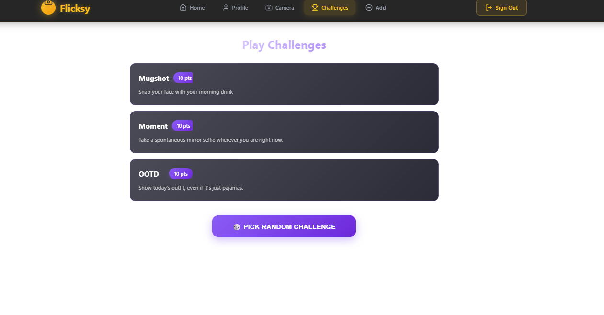

# Flicksy
## Date: 23/10/2025

### By: Eman Rauf, Jameela Mohammed, Naser hubaishi
### | [Eman GitHub](https://github.com/emannn077) | [Jameela GitHub](https://github.com/jamsaeed)| [Naser GitHub](https://github.com/envwx)
***
### ***Description***
Flicksy, a home base for exploring everything happening around, from newly posted photos to bunch of fun challenges!
***
* ***Challenges:***
Join fun photo challenges where you post, engage with other friends and connect with everyone!

* ***Profile Page:***
Your personal page on flicksy! it's where you can view posts, and all such!
* ***Posts Feed:***
Catch up on the latest posts from friends and the flicksy community, scroll, and discover amazing photos every day.
* ***Comments under posts:***
Share your thoughts, drop a compliments, or even connect with friends to see what they're up to!
* ***Sign up & Sign in:***
join Flicksy in just few taps, Create an account to start posting, commenting, and joining challenges, or sign back in to continue where you left!
* ***Post Photos:***
Got a moment you'd love to share? On Flicksy upload your shots to show off the world your captured moments.
* ***Delete posted photos and comments:***
changed your mind about the photo you posted or your comment had a typo? You'd be easily able to delete any of your posts or comments anytime you want!

####
***
## ERD & Figma
###  
### | [Figma Link](https://www.figma.com/design/gS2yraKCDYZh3EWiLtBEsz/project-3-wire-frame?node-id=0-1&t=qvgIBTwAXNB3OOeu-1)
***
## ***App Hierarchy***

### ***Technologies used in our project***
  * MongoDB
  * Express
  * Node.js
  * React
  * Github
  * react webcam
  * Insomia

***

# Featuring in the project

* Home Page
* Play Challenges
* Profile page
* Posting Photo in Real Time
* Comment Feature
* Sign In/ Sign Up
* Camera Page
* Delete the Post
* Add a Challenge
***

## ***Project Preview***

***

  ***

## ***Future Work***
* To have edit and delete comment feature
* To have Like and Favorite the post feature
* To have ready made cool captions so the user can select easily

## ***References ***
* https://www.npmjs.com/package/react-webcam
* For Profile Page implementation i took a hint/idea from "https://medium.com/@s.frei1996/creating-your-first-react-profile-page-cf0a00c8dfa0"
